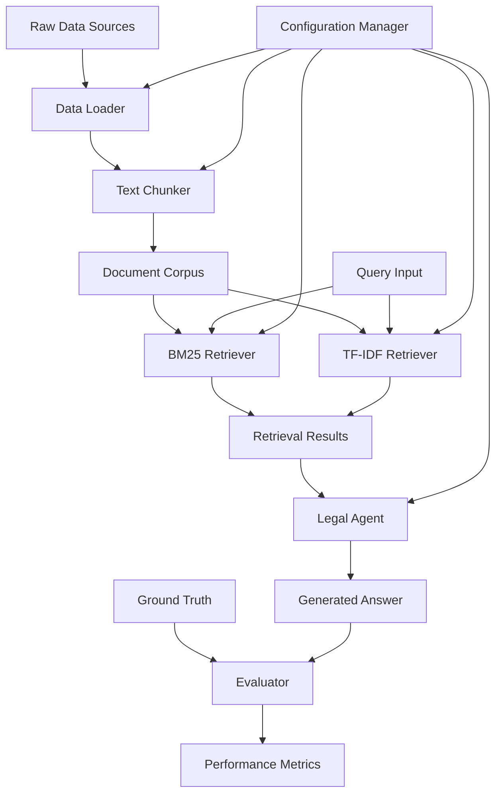
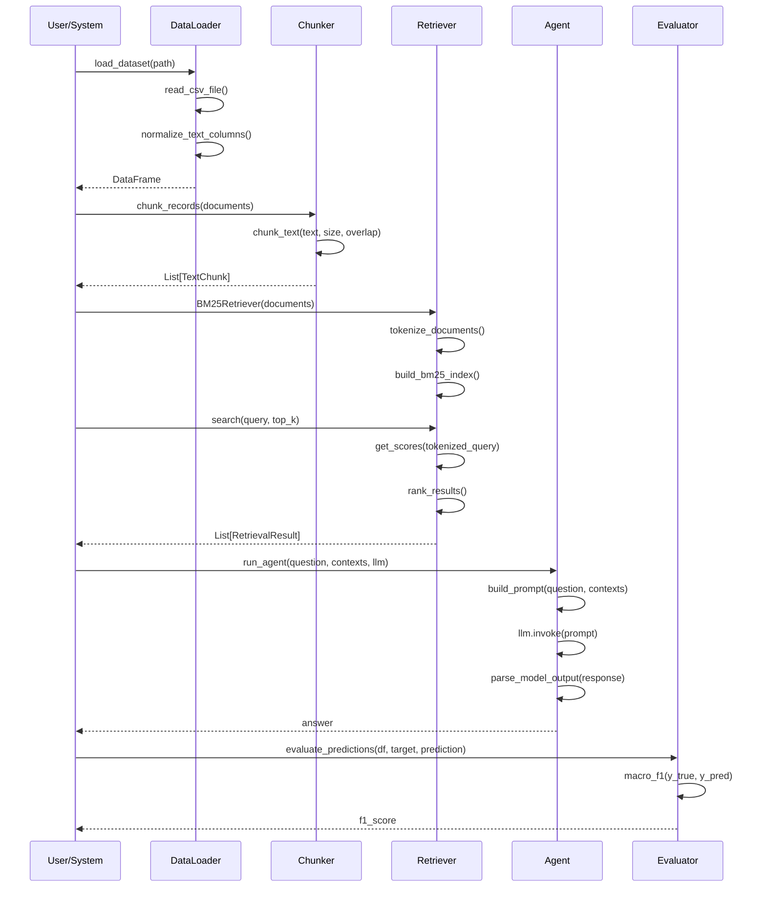

# Design Document: Retrieval Evaluation System

## Overview

The Retrieval Evaluation System is a machine learning pipeline designed for legal document retrieval and evaluation. The system processes Swiss legal documents, creates searchable indices using multiple retrieval algorithms (BM25, TF-IDF), and provides an agent-based question-answering interface. The architecture supports both baseline experiments and advanced retrieval-augmented generation (RAG) workflows for legal reasoning tasks.

The system follows a modular design with clear separation between data processing, retrieval mechanisms, evaluation metrics, and agent-based reasoning. It supports multiple retrieval strategies and provides comprehensive evaluation capabilities for comparing different approaches on legal document retrieval tasks.

## Architecture



## Sequence Diagrams

### Main Retrieval Workflow



## Components and Interfaces

### Component 1: DataLoader

**Purpose**: Handles loading and preprocessing of CSV datasets with text normalization capabilities.

**Interface**:
```python
def load_dataset(path: str | Path, text_columns: Iterable[str] | None = None, **kwargs) -> pd.DataFrame
def read_csv_file(path: str | Path, **kwargs) -> pd.DataFrame
def normalize_text_columns(frame: pd.DataFrame, columns: Iterable[str]) -> pd.DataFrame
def clean_text(value: object) -> str
```

**Responsibilities**:
- Load CSV files with error handling for missing files
- Normalize and clean text columns by removing extra whitespace
- Provide consistent interface for dataset loading across the system
- Handle various text column naming conventions

### Component 2: TextChunker

**Purpose**: Splits large documents into smaller, overlapping chunks for efficient retrieval and processing.

**Interface**:
```python
@dataclass(frozen=True)
class TextChunk:
    chunk_id: int
    source_id: str
    text: str

def chunk_text(text: str, chunk_size: int = 4000, overlap: int = 200) -> list[str]
def chunk_records(records: Iterable[tuple[str, str]], chunk_size: int = 4000, overlap: int = 200) -> list[TextChunk]
```

**Responsibilities**:
- Split documents into manageable chunks with configurable size and overlap
- Maintain source document traceability through chunk metadata
- Validate chunking parameters to prevent invalid configurations
- Handle edge cases like empty documents and boundary conditions

### Component 3: Retriever

**Purpose**: Implements multiple retrieval algorithms (BM25, TF-IDF) for document search and ranking.

**Interface**:
```python
@dataclass(frozen=True)
class RetrievalResult:
    index: int
    score: float
    text: str

class BM25Retriever:
    def __init__(self, documents: Sequence[str])
    def search(self, query: str, top_k: int = 10) -> list[RetrievalResult]

class TfidfRetriever:
    def __init__(self, documents: Sequence[str])
    def search(self, query: str, top_k: int = 10) -> list[RetrievalResult]
```

**Responsibilities**:
- Build and maintain search indices for different retrieval algorithms
- Execute queries and return ranked results with relevance scores
- Provide consistent interface across different retrieval methods
- Handle tokenization and text preprocessing for search

### Component 4: LegalAgent

**Purpose**: Provides question-answering capabilities using retrieved context and language models.

**Interface**:
```python
@dataclass(frozen=True)
class AgentConfig:
    temperature: float = 0.0
    max_context_chunks: int = 5

def build_prompt(question: str, contexts: Iterable[str]) -> str
def parse_model_output(text: str) -> str
def run_agent(question: str, contexts: Iterable[str], llm) -> str
```

**Responsibilities**:
- Construct prompts with question and retrieved context
- Interface with language models for answer generation
- Parse and clean model outputs for consistent formatting
- Manage context window limitations through chunk selection

### Component 5: Evaluator

**Purpose**: Computes performance metrics for retrieval and question-answering tasks.

**Interface**:
```python
def macro_f1(y_true: Iterable, y_pred: Iterable) -> float
def evaluate_predictions(frame: pd.DataFrame, target_column: str, prediction_column: str) -> float
```

**Responsibilities**:
- Calculate macro F1 scores for multi-class evaluation
- Validate prediction dataframes and column existence
- Provide standardized evaluation interface for different tasks
- Handle edge cases like empty datasets

## Data Models

### Model 1: TextChunk

```python
@dataclass(frozen=True)
class TextChunk:
    chunk_id: int      # Unique identifier for the chunk
    source_id: str     # Reference to original document
    text: str          # Chunk content
```

**Validation Rules**:
- chunk_id must be non-negative integer
- source_id must be non-empty string
- text should be non-empty after stripping whitespace

### Model 2: RetrievalResult

```python
@dataclass(frozen=True)
class RetrievalResult:
    index: int         # Document index in corpus
    score: float       # Relevance score
    text: str          # Document content
```

**Validation Rules**:
- index must be non-negative and within corpus bounds
- score should be finite number (not NaN or infinity)
- text should contain the actual document content

### Model 3: AgentConfig

```python
@dataclass(frozen=True)
class AgentConfig:
    temperature: float = 0.0        # LLM sampling temperature
    max_context_chunks: int = 5     # Maximum context chunks to use
```

**Validation Rules**:
- temperature must be between 0.0 and 2.0
- max_context_chunks must be positive integer
- Configuration should be immutable once created

## Algorithmic Pseudocode

### Main Processing Algorithm

```pascal
ALGORITHM processRetrievalPipeline(train_data, test_data, laws_data)
INPUT: train_data, test_data, laws_data of type DataFrame
OUTPUT: submission of type DataFrame

BEGIN
  ASSERT NOT train_data.empty AND NOT test_data.empty AND NOT laws_data.empty
  
  // Step 1: Build law corpus with text extraction
  law_documents ← buildLawCorpus(laws_data)
  ASSERT law_documents.length > 0
  
  // Step 2: Create document chunks with overlap
  chunked_laws ← chunkRecords(law_documents, chunk_size=4000, overlap=200)
  
  // Step 3: Initialize retrieval system
  retriever ← BM25Retriever(law_documents)
  
  // Step 4: Process test queries with retrieval
  predictions ← []
  FOR each row IN test_data DO
    ASSERT row.query IS NOT NULL
    
    query ← extractQuery(row)
    results ← retriever.search(query, top_k=10)
    
    IF results.length > 0 THEN
      predictions.append(results[0].text)
    ELSE
      predictions.append("")
    END IF
  END FOR
  
  // Step 5: Create submission format
  submission ← DataFrame(predictions=predictions)
  IF test_data.has_column("row_id") THEN
    submission.insert("row_id", test_data["row_id"])
  END IF
  
  ASSERT submission.length = test_data.length
  
  RETURN submission
END
```

**Preconditions:**
- Input dataframes are loaded and non-empty
- Law documents contain extractable text content
- Test data contains valid query columns
- Retrieval system can be initialized with law documents

**Postconditions:**
- Submission dataframe has same length as test data
- All predictions are strings (may be empty)
- Row IDs are preserved if present in test data
- Retrieval system is properly initialized and functional

**Loop Invariants:**
- predictions.length equals number of processed test rows
- All processed queries have corresponding predictions
- Retrieval results maintain score ordering (highest first)

### Text Chunking Algorithm

```pascal
ALGORITHM chunkText(text, chunk_size, overlap)
INPUT: text of type String, chunk_size of type Integer, overlap of type Integer
OUTPUT: chunks of type List[String]

BEGIN
  ASSERT chunk_size > 0 AND overlap >= 0 AND overlap < chunk_size
  
  IF text.isEmpty() THEN
    RETURN []
  END IF
  
  chunks ← []
  start ← 0
  length ← text.length
  step ← chunk_size - overlap
  
  WHILE start < length DO
    ASSERT start >= 0 AND start < length
    
    end ← min(length, start + chunk_size)
    chunk ← text.substring(start, end).strip()
    
    IF NOT chunk.isEmpty() THEN
      chunks.append(chunk)
    END IF
    
    IF end >= length THEN
      BREAK
    END IF
    
    start ← start + step
    
    ASSERT start > (start - step)  // Progress guarantee
  END WHILE
  
  ASSERT chunks.length > 0 OR text.strip().isEmpty()
  
  RETURN chunks
END
```

**Preconditions:**
- chunk_size is positive integer
- overlap is non-negative and less than chunk_size
- text is valid string (may be empty)

**Postconditions:**
- Returns list of non-empty string chunks
- Each chunk length ≤ chunk_size
- Adjacent chunks overlap by specified amount
- All text content is covered by chunks

**Loop Invariants:**
- start position advances by (chunk_size - overlap) each iteration
- All created chunks are non-empty after stripping
- start position never exceeds text length

### BM25 Search Algorithm

```pascal
ALGORITHM bm25Search(query, documents, top_k)
INPUT: query of type String, documents of type List[String], top_k of type Integer
OUTPUT: results of type List[RetrievalResult]

BEGIN
  ASSERT NOT query.isEmpty() AND documents.length > 0 AND top_k > 0
  
  // Step 1: Tokenize query and documents
  query_tokens ← tokenize(query.toLowerCase())
  tokenized_docs ← []
  FOR each doc IN documents DO
    tokenized_docs.append(tokenize(doc.toLowerCase()))
  END FOR
  
  // Step 2: Build BM25 index
  bm25_model ← BM25Okapi(tokenized_docs)
  
  // Step 3: Calculate relevance scores
  scores ← bm25_model.getScores(query_tokens)
  ASSERT scores.length = documents.length
  
  // Step 4: Rank documents by score
  ranked_indices ← []
  FOR i ← 0 TO scores.length - 1 DO
    ranked_indices.append((i, scores[i]))
  END FOR
  
  // Sort by score descending
  ranked_indices.sortBy(lambda pair: pair.score, reverse=true)
  
  // Step 5: Return top-k results
  results ← []
  FOR i ← 0 TO min(top_k, ranked_indices.length) - 1 DO
    index ← ranked_indices[i].index
    score ← ranked_indices[i].score
    text ← documents[index]
    results.append(RetrievalResult(index, score, text))
  END FOR
  
  ASSERT results.length <= top_k
  ASSERT results.length <= documents.length
  
  RETURN results
END
```

**Preconditions:**
- query is non-empty string
- documents list contains at least one document
- top_k is positive integer
- All documents are valid strings

**Postconditions:**
- Returns at most top_k results
- Results are sorted by relevance score (descending)
- Each result contains valid index, score, and text
- All returned indices are within document bounds

**Loop Invariants:**
- All processed documents have corresponding scores
- Ranking maintains score ordering throughout sorting
- Result indices always reference valid documents

## Key Functions with Formal Specifications

### Function 1: load_dataset()

```python
def load_dataset(path: str | Path, text_columns: Iterable[str] | None = None, **kwargs) -> pd.DataFrame
```

**Preconditions:**
- `path` is valid file path (string or Path object)
- `text_columns` is iterable of valid column names or None
- File at path exists and is readable CSV format

**Postconditions:**
- Returns pandas DataFrame with loaded data
- If file doesn't exist, returns empty DataFrame
- Text columns are normalized if specified
- DataFrame structure matches CSV file structure

**Loop Invariants:** N/A (no explicit loops in function)

### Function 2: chunk_records()

```python
def chunk_records(records: Iterable[tuple[str, str]], chunk_size: int = 4000, overlap: int = 200) -> list[TextChunk]
```

**Preconditions:**
- `records` is iterable of (source_id, text) tuples
- `chunk_size` is positive integer
- `overlap` is non-negative and less than chunk_size
- All source_ids are non-empty strings

**Postconditions:**
- Returns list of TextChunk objects
- Each chunk has unique chunk_id starting from 0
- Source traceability maintained through source_id
- Total chunks >= number of non-empty input records

**Loop Invariants:**
- chunk_id increments monotonically for each created chunk
- All created chunks reference valid source documents
- Chunk text content is non-empty after processing

### Function 3: search()

```python
def search(self, query: str, top_k: int = 10) -> list[RetrievalResult]
```

**Preconditions:**
- `query` is non-empty string
- `top_k` is positive integer
- Retriever is initialized with non-empty document corpus
- Internal model/index is properly built

**Postconditions:**
- Returns list of RetrievalResult objects
- Results are sorted by relevance score (descending)
- Length of results ≤ min(top_k, corpus_size)
- All result indices are valid document references

**Loop Invariants:**
- Score calculation maintains document order consistency
- Ranking preserves relative score relationships
- All returned results have finite, comparable scores

## Example Usage

```python
# Example 1: Basic pipeline usage
from src.data_loader import load_dataset
from src.chunker import chunk_records
from src.retriever import BM25Retriever

# Load datasets
train_df = load_dataset("data/raw/train.csv", text_columns=["question", "answer"])
laws_df = load_dataset("data/raw/laws_de.csv", text_columns=["text", "article_text"])

# Build law corpus
law_documents = laws_df["text"].fillna("").tolist()
chunked_laws = chunk_records(enumerate(law_documents), chunk_size=4000, overlap=200)

# Initialize retriever
retriever = BM25Retriever([chunk.text for chunk in chunked_laws])

# Example 2: Query processing
query = "What are the regulations for data protection?"
results = retriever.search(query, top_k=5)

for result in results:
    print(f"Score: {result.score:.3f}")
    print(f"Text: {result.text[:200]}...")
    print("---")

# Example 3: Agent-based QA
from src.agent import run_agent, AgentConfig

contexts = [result.text for result in results[:3]]
answer = run_agent(query, contexts, llm_model)
print(f"Generated Answer: {answer}")

# Example 4: Evaluation
from src.evaluator import evaluate_predictions

predictions_df = pd.DataFrame({
    "target": ["answer1", "answer2", "answer3"],
    "prediction": ["answer1", "pred2", "answer3"]
})

f1_score = evaluate_predictions(predictions_df, "target", "prediction")
print(f"Macro F1 Score: {f1_score:.3f}")
```

## Correctness Properties

*A property is a characteristic or behavior that should hold true across all valid executions of a system-essentially, a formal statement about what the system should do. Properties serve as the bridge between human-readable specifications and machine-verifiable correctness guarantees.*

### Property 1: Text Processing Consistency

*For any* text input with whitespace variations, text normalization should remove extra whitespace while preserving content and produce consistent formatting across all processing components.

**Validates: Requirements 1.2, 4.3**

### Property 2: Data Structure Preservation

*For any* input dataset, the system should preserve row count, relationships, and identifiers throughout all processing stages, ensuring data integrity from input to output.

**Validates: Requirements 1.5, 8.4, 8.5, 8.6**

### Property 3: Chunking Consistency

*For any* document and valid chunking parameters, all generated chunks should have non-negative sequential IDs, maintain source traceability, respect size limits, and contain non-empty text content.

**Validates: Requirements 2.1, 2.4, 2.6**

### Property 4: Retrieval Result Ordering and Limiting

*For any* search query and top_k parameter, retrieval results should be sorted by relevance score in descending order and contain at most top_k results with finite scores.

**Validates: Requirements 3.2, 3.3, 3.4**

### Property 5: Tokenization Consistency

*For any* text input, the tokenization and preprocessing should be consistent between queries and documents, ensuring comparable processing across all retrieval operations.

**Validates: Requirements 3.6**

### Property 6: Prompt Construction Completeness

*For any* question and context documents, the constructed prompt should contain both the question and all provided context elements in a structured format.

**Validates: Requirements 4.2**

### Property 7: Context Management

*For any* set of context documents and chunk limits, the agent should select appropriate chunks that respect the maximum context window while maintaining content relevance.

**Validates: Requirements 4.4**

### Property 8: Evaluation Metric Bounds

*For any* predictions and ground truth data, calculated F1 scores should be bounded between 0.0 and 1.0 and return standardized performance metrics.

**Validates: Requirements 5.1, 5.4, 5.5**

### Property 9: Data Model Validation

*For any* data model object creation (TextChunk, RetrievalResult, AgentConfig), all validation rules should be enforced before instantiation, ensuring field constraints and immutability.

**Validates: Requirements 6.1, 6.2, 6.3, 6.4, 6.5**

### Property 10: Parameter Validation and Recovery

*For any* invalid parameters provided to system components, the system should substitute valid defaults, log corrections, and provide descriptive error messages.

**Validates: Requirements 7.2, 7.5**

## Error Handling

### Error Scenario 1: Missing Data Files

**Condition**: Required CSV files (train.csv, test.csv, laws_de.csv) are missing or unreadable
**Response**: DataLoader returns empty DataFrame, system logs warning and continues with available data
**Recovery**: System gracefully handles empty datasets, skips processing steps that require data

### Error Scenario 2: Invalid Chunking Parameters

**Condition**: chunk_size ≤ 0 or overlap ≥ chunk_size
**Response**: TextChunker raises ValueError with descriptive message
**Recovery**: Use default parameters (chunk_size=4000, overlap=200) and log parameter correction

### Error Scenario 3: Empty Document Corpus

**Condition**: No valid documents available for retrieval index building
**Response**: Retriever initialization creates empty index, search returns empty results
**Recovery**: System continues operation but logs warning about empty corpus

### Error Scenario 4: LLM API Failures

**Condition**: Language model API is unavailable or returns errors
**Response**: Agent catches exceptions and returns fallback response or error message
**Recovery**: Implement retry logic with exponential backoff, fallback to rule-based responses

### Error Scenario 5: Evaluation Data Mismatch

**Condition**: Prediction and ground truth data have different lengths or missing columns
**Response**: Evaluator raises KeyError or ValueError with specific column/length information
**Recovery**: Validate data shapes before evaluation, align datasets by common identifiers

## Testing Strategy

### Unit Testing Approach

Each component has comprehensive unit tests covering:
- **DataLoader**: File loading, text normalization, error handling for missing files
- **TextChunker**: Boundary conditions, parameter validation, chunk overlap verification
- **Retrievers**: Index building, query processing, result ranking, empty corpus handling
- **Agent**: Prompt construction, output parsing, context management
- **Evaluator**: Metric calculation, data validation, edge cases

Target coverage: 90%+ line coverage with focus on critical paths and error conditions.

### Property-Based Testing Approach

**Property Test Library**: Hypothesis (Python)

**Key Properties to Test**:
- Chunk size constraints: Generated chunks never exceed specified size
- Retrieval ordering: Search results maintain score-based ordering
- Text normalization: Cleaned text has no leading/trailing whitespace
- Evaluation bounds: F1 scores always between 0.0 and 1.0
- Data consistency: Loaded DataFrames preserve row count relationships

**Example Property Tests**:
```python
@given(text=st.text(), chunk_size=st.integers(min_value=1, max_value=10000))
def test_chunk_size_property(text, chunk_size):
    chunks = chunk_text(text, chunk_size=chunk_size, overlap=0)
    assert all(len(chunk) <= chunk_size for chunk in chunks)

@given(documents=st.lists(st.text(min_size=1), min_size=1), 
       query=st.text(min_size=1))
def test_retrieval_ordering_property(documents, query):
    retriever = BM25Retriever(documents)
    results = retriever.search(query, top_k=len(documents))
    scores = [r.score for r in results]
    assert scores == sorted(scores, reverse=True)
```

### Integration Testing Approach

End-to-end pipeline tests covering:
- Complete data loading → chunking → retrieval → evaluation workflow
- Multi-retriever comparison (BM25 vs TF-IDF performance)
- Agent integration with different LLM backends
- Performance benchmarking with realistic dataset sizes

## Performance Considerations

**Indexing Performance**: BM25 and TF-IDF index building scales O(n×m) where n=documents, m=average document length. For large corpora (>100K documents), consider incremental indexing or distributed processing.

**Memory Usage**: Document corpus and indices stored in memory. Estimate ~1-2GB RAM per 100K documents. Implement document streaming for very large datasets.

**Query Latency**: Target <100ms for single query retrieval. BM25 typically faster than TF-IDF for sparse queries. Consider caching for repeated queries.

**Chunking Strategy**: Overlap size affects both memory usage and retrieval quality. 200-token overlap provides good balance between context preservation and efficiency.

## Security Considerations

**Data Privacy**: Legal documents may contain sensitive information. Implement data anonymization for development/testing environments.

**Input Validation**: Sanitize all user queries to prevent injection attacks. Validate file paths to prevent directory traversal.

**Model Security**: If using external LLM APIs, implement rate limiting and API key rotation. Consider on-premises deployment for sensitive legal data.

**Access Control**: Implement role-based access for different user types (researchers, legal professionals, administrators).

## Dependencies

**Core ML Libraries**:
- scikit-learn: TF-IDF vectorization, evaluation metrics
- rank_bm25: BM25 implementation for document retrieval
- pandas: Data manipulation and CSV processing
- numpy: Numerical computations and array operations

**NLP and LLM Integration**:
- transformers: Hugging Face model integration
- sentence-transformers: Dense vector embeddings
- langchain: LLM abstraction and prompt management
- langgraph: Agent workflow orchestration

**Utilities and Performance**:
- torch: PyTorch backend for neural models
- joblib: Model serialization and parallel processing
- tqdm: Progress bars for long-running operations

**Development and Testing**:
- pytest: Unit and integration testing framework
- hypothesis: Property-based testing library
- jupyter: Interactive development and experimentation